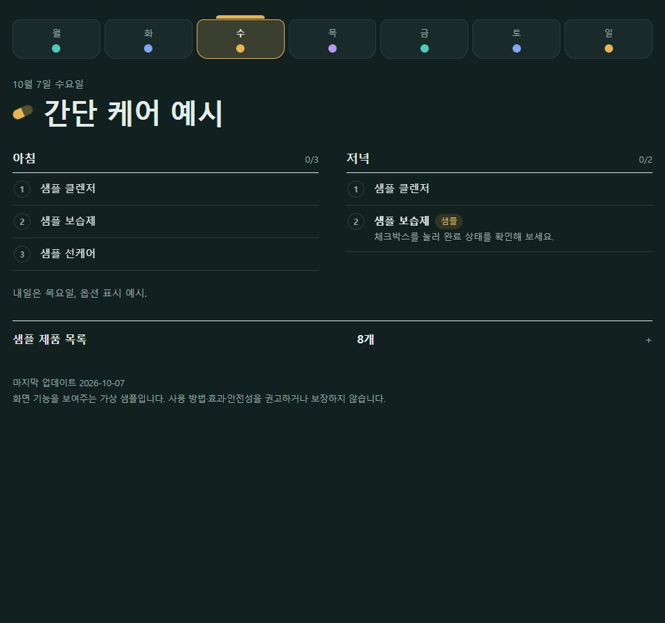
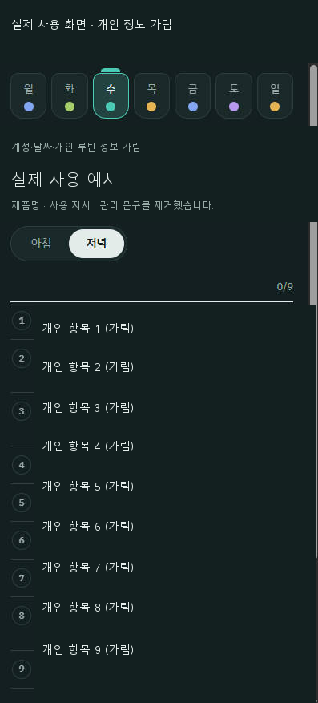

# 오늘의 스킨케어 위젯

요일별 아침·저녁 루틴을 보여주고 오늘의 완료 항목을 체크하는 작은 위젯이에요. `index.html` 하나로 실행하며, 표시할 항목은 파일 위쪽의 `CONFIG`에서 바꿉니다. 한국어 UI이며 서버·계정·패키지 설치가 필요하지 않습니다.

**A single-file Korean AM/PM routine checklist.** The public demo uses fictional items, with no personal product list or treatment history.



[공개 데모](https://bloglluukk-glitch.github.io/skincare-routine-widget/) · [Claude 프롬프트 6종](PROMPTS.md)

## 실제 사용 예시

제가 실제 사용하는 화면이며 개인 루틴 정보는 가렸습니다. 제품·디바이스 이름, 사용 시간·횟수·혼합량, 관리 문구, 날짜, 상단 계정·아티팩트 UI를 불투명하게 가렸고 이미지 메타데이터를 제거했습니다. 원본은 이 저장소에 포함하지 않습니다. 이 이미지는 직접 사용한다는 설명을 위한 것으로 효과·안전성·임상 검증을 뜻하지 않습니다.



## 실행하기

1. 저장소를 내려받아 압축을 풉니다.
2. `index.html`을 브라우저에서 엽니다. 시스템 글꼴을 사용하므로 인터넷 없이 화면을 표시할 수 있습니다.
3. 개인 루틴으로 쓰려면 **공개 저장소 밖에 복사한 파일**의 `CONFIG`를 수정하세요.

GitHub Pages 데모는 `main` 브랜치의 루트(`/`)에서 제공합니다. 공개 저장소와 Pages에 올린 `CONFIG`, 문서, 이미지는 누구나 볼 수 있습니다. `.gitignore`는 기존에 커밋된 내용을 숨기지 않습니다.

## 기능

- 현재 기기의 날짜·요일로 오늘의 루틴 표시
- 좁은 화면에서 아침·저녁 탭 전환: 기본 기준은 15시(`amUntilHour`, 0~24)
- 760px 이상에서는 아침·저녁을 나란히 표시
- 오늘의 단계 체크 및 브라우저 `localStorage` 저장
- 같은 주의 다른 요일 미리보기와 오늘로 돌아오기
- ISO 주 번호를 기준으로 `rotate` 항목을 2주·4주 등 순환 표시
- 설정한 쉬는 항목과 내일 안내, 제품 목록 및 `gone` 항목 표시
- 시스템의 밝은·어두운 화면 설정에 따라 색상 변경

다른 요일 미리보기에서는 체크할 수 없습니다. 날짜가 바뀌면 다음 1분 확인 또는 화면 복귀 시 새로고침하여 이전 날짜의 체크를 사용하지 않습니다. 체크 기록은 기기·브라우저·사이트 주소별이며 동기화되지 않습니다. 브라우저가 저장소를 막으면 새로고침 후 상태가 유지되지 않을 수 있습니다. 기록은 브라우저의 사이트 데이터 삭제로 지울 수 있습니다.

위젯 코드에는 분석 도구, 외부 글꼴, 외부 API 호출이 없습니다. Pages를 방문할 때 HTML 등 정적 파일을 받는 호스팅 요청은 발생합니다. Claude에 개인 파일을 직접 첨부하면 별도의 외부 전송이므로 공개용 샘플 파일만 사용하세요.

## CONFIG 구조

공개본은 가상의 `샘플` 항목만 담습니다. 제품 사용량·성분 조합·시술 후 관리 일정은 제공하지 않습니다.

```js
var CONFIG = {
  title: '오늘의 스킨케어 · 샘플',
  updated: '2026-10-07',
  amUntilHour: 15,
  footer: '가상의 화면 예시입니다.',
  types: {
    basic: { label: '기본 예시', color: '#0F8674', dark: '#4CCBB6' }
  },
  days: {
    mon: { type: 'basic', title: '기본 케어 예시',
      am: ['샘플 클렌저', '샘플 보습제'],
      pm: [{ name: '샘플 보습제', kind: 'basic', tag: '예시' }] }
  },
  inventory: [{ group: '가상 항목', items: ['샘플 보습제'] }]
};
```

`days`의 키는 `mon`, `tue`, `wed`, `thu`, `fri`, `sat`, `sun`입니다. 생략한 요일은 빈 루틴으로 표시됩니다.

| 필드 | 표시 내용 |
|---|---|
| `name` | 단계 이름 |
| `kind` | `types`에 정의한 색상 키 |
| `tag`, `note` | 꼬리표와 설명 |
| `rotate` | `['샘플 A', '샘플 B']`처럼 주마다 교체하는 이름 |
| `mix` | 사용자가 작성한 혼합 메모를 그대로 표시하는 기능. 혼합 가능성을 판단하지 않음 |
| `amNote`, `pmNote`, `prep`, `rest` | 시간대 설명·다음 날 안내·쉬는 항목 |
| `gone` | 제품 목록에는 표시하되 개수에서 제외 |

이 위젯은 입력한 글자를 표시할 뿐 제품 호환성이나 루틴의 적절성을 검증하지 않습니다. JavaScript 문법을 유지하고 `types`의 색상에는 CSS 색상 값만 넣으세요.

## Windows 런처 (선택 사항)

웹 UI는 `index.html`만으로 사용할 수 있습니다. 런처는 설치된 Chrome을 앱 창으로 열고 창 크기·위치·항상 위 표시를 조정합니다.

- `launcher/windows/skincare-widget.bat`: PowerShell 런처 호출
- `launcher/windows/skincare-widget.ps1`: Chrome 실행과 Win32 창 배치
- `launcher/windows/install-autostart.bat` / `.ps1`: **사용자가 선택해서 실행할 때만** 현재 사용자의 Startup 폴더에 `Skincare Widget.lnk` 생성

스크립트를 먼저 읽고 실행하세요. 공개본은 `ExecutionPolicy Bypass`를 사용하지 않으며, 실행 정책이나 보안 경고 때문에 차단되면 보호 기능을 변경하지 말고 `index.html`을 직접 여세요. 자동시작은 필수가 아닙니다. 이미 설치했다면 Windows의 `shell:startup`에서 해당 바로가기를 삭제하여 해제할 수 있습니다.

크기·위치·항상 위 여부·`$Url`은 `.ps1` 위쪽에서 설정합니다. 기본 주소는 저장소의 로컬 `index.html`입니다. 런처가 기본 Chrome 프로필을 사용하면 브라우저 동기화 설정이 영향을 줄 수 있습니다.

## 검증과 한계

[검증 범위](docs/TESTING.md)에 웹 UI와 런처 검사를 구분해 기록했습니다. Windows 런처의 실제 실행, 창 고정, 자동시작 설치는 테스트하지 않았습니다.

가상 샘플과 실제 사용 예시는 화면·사용 방식의 설명입니다. 의학적 효과·안전성·임상 검증을 뜻하지 않습니다. 시술 후 관리나 약물 사용 결정은 위젯·AI 프롬프트로 정하지 마세요. `PROMPTS.md`도 AI 결과의 정확성을 보장하지 않습니다.

## License

[MIT](LICENSE) · Copyright © 2026 bloglluukk-glitch
